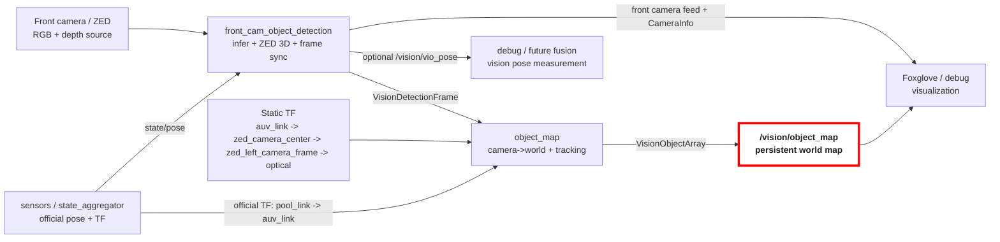

# Vision Package

This package contains the front-camera detection pipeline, the persistent 3D object map, optional image enhancement nodes, and the model-training/export helpers.

Key files:
- [vision_pipeline.launch.py](launch/vision_pipeline.launch.py)
- [front_cam_object_detection_node.py](vision/object_detection/front_cam_object_detection_node.py)
- [object_map.cpp](vision/object_map.cpp)
- [object_tracker.cpp](vision/object_map/object_tracker.cpp)

## Usage

Launch the full pipeline:

```bash
ros2 launch vision vision_pipeline.launch.py
```

Configuration is loaded from [config/vision_pipeline.yaml](config/vision_pipeline.yaml).

### Changing Pools (Pool-Side Calibration)

When deploying the AUV at a new pool, there is **only one primary parameter** you need to change in [config/vision_pipeline.yaml](config/vision_pipeline.yaml) to ensure all 3D projections, locking, and depth calculations function correctly:

1. **`pool_floor_z`**: Under `object_map.ros__parameters.z_axis_locking.pool_floor_z` (default `-2.1`), set this to the absolute depth of your pool in meters (negative value).
   
   *Note: Updating this single value automatically propagates to the front camera depth estimation plane, the down-camera raycasting plane (which dynamically projects to `pool_floor_z + table_height` for table-top items), and the C++ map snap-to-floor constraints.*

Other pool-specific parameters to optionally verify:
* **`pool_surface_z`**: Under `object_map.ros__parameters.z_axis_locking.pool_surface_z` (default `0.0`), change if the relative water level offset changes.
* **`lane_boundary`**: If wall-reflection/clutter filtering is needed, remember to set **`enable: true`**, and then adjust the `x_min`, `x_max`, `y_min`, and `y_max` AABB coordinates to match your active competition lane dimensions.

### Calculating Camera Intrinsics (For Future Reference)
* Downward-facing Camera Model: [ELP-USB500W02M-AF60](https://www.webcamerausb.com/elp-5megapixel-high-resolution-autofocus-usb-camera-module-usb20-ov5640-color-cmos-sensor-60degree-lens-not-support-otg-p-63.html)

If you replace the downward-facing camera module or change the resolution of `down_cam_object_detection` in `vision_pipeline.yaml` (e.g. from 640x480 to 1280x720), you must recompute and update the camera intrinsics (`fx`, `fy`, `cx`, `cy`) under the `down_cam_object_detection` block for accurate 3D ray-casting.

Here is the general formula for a standard pinhole camera model based on the lens's **Diagonal Field of View (DFOV)** and the image resolution ($W \times H$):

1. **Diagonal in Pixels ($D_{\text{pixels}}$)**:
   $$D_{\text{pixels}} = \sqrt{W^2 + H^2}$$
   *(For $640 \times 480$: $D_{\text{pixels}} = \sqrt{640^2 + 480^2} = 800\text{ pixels}$)*

2. **Focal Length in Pixels ($f$)**:
   $$f_x = f_y = f = \frac{D_{\text{pixels}}}{2 \tan\left(\frac{\theta_d}{2}\right)}$$
   Where $\theta_d$ is the Diagonal FOV of the lens in degrees.
   *(For a 60° FOV lens at 640x480: $f = \frac{800}{2 \tan(30^\circ)} = 400\sqrt{3} \approx 692.8$)*
   
   *Note: $f_x$ and $f_y$ represent the focal length scaled by the physical pixel pitch along the horizontal ($p_x$) and vertical ($p_y$) directions ($f_x = F / p_x, f_y = F / p_y$). Since modern CMOS sensors (like the OV5640) use perfectly **square pixels** ($p_x = p_y = 1.4\mu\text{m}$), the horizontal and vertical focal lengths in pixels are identical ($f_x = f_y$).*

3. **Principal Point / Optical Center ($c_x, c_y$)**:
   $$c_x = \frac{W}{2}, \quad c_y = \frac{H}{2}$$
   *(For $640 \times 480$: $c_x = 320.0$, $c_y = 240.0$)*

4. **Horizontal and Vertical Field of View (FOV)**:
   Using the focal length $f$:
   * **Horizontal FOV (HFOV)**: $\text{HFOV} = 2 \cdot \arctan\left(\frac{W}{2f}\right) = 2 \cdot \arctan\left(\frac{640}{2 \cdot 692.8}\right) \approx 49.6^\circ$
   * **Vertical FOV (VFOV)**: $\text{VFOV} = 2 \cdot \arctan\left(\frac{H}{2f}\right) = 2 \cdot \arctan\left(\frac{480}{2 \cdot 692.8}\right) \approx 38.2^\circ$

### Launch Parameters

| Parameter | Type | Default | Description |
|-----------|------|---------|-------------|
| `sim` | `bool` | `false` | Use simulation mode (sim topics, sim camera settings) |
| `compressed` | `bool` | `true` | Append `/compressed` to image topic names |
| `enhance_images` | `bool` | `false` | Enable image enhancement nodes; detection nodes subscribe to enhanced topics when true |
| `front_model_relative_path` | `string` | `models/rfdetr_onnx` | Path to front camera model package relative to vision package |
| `down_model_relative_path` | `string` | `models/template_yolo` | Path to down camera model package relative to vision package |
| `enable_object_detection` | `bool` | `true` | Enable object detection inference globally |
| `has_zed_sdk` | `bool` | `true` | Whether the ZED SDK is available (set `false` for non-ZED hardware) |

Example overrides:

```bash
ros2 launch vision vision_pipeline.launch.py sim:=true
ros2 launch vision vision_pipeline.launch.py compressed:=false
ros2 launch vision vision_pipeline.launch.py front_model_relative_path:=models/rfdetr_onnx
```

## Architecture



Node summary:
- `Front camera / ZED`: Provides the raw RGB images and ZED depth data used to build 3D detections.
- `sensors / state_aggregator`: Publishes the official aggregated AUV pose and the official `pool_link -> auv_link` TF.
- `front_cam_object_detection`: Runs the detector, asks ZED for 3D object positions, and packages each frame with one synchronized AUV pose.
- `Static TF`: Describes the fixed mounting relationship between the AUV body frame and the front camera frames.
- `object_map`: Converts camera-frame detections into world-frame objects and tracks them over time.
- `/vision/object_map`: **Main output**, exposes the persistent world-frame map as `VisionObjectArray`.
- `Foxglove / debug`: Visualizes the front camera feed, camera calibration, and mapped detections.
- `debug / future fusion`: Carries the optional vision-only VIO pose output for debugging or later estimator fusion.

## Nodes
### Small note on parameter nomenclature
Parameters in [`vision_pipeline.yaml`](config/vision_pipeline.yaml) are named with a hierarchical convention, where the node name is the highest level for the given node, e.g.
```yaml
front_cam_object_detection:
  ros__parameters:
    zed:
      resolution:
          sim: SVGA
```
refers to the zed camera resolution in simulation. This allows all parameters to be loading directly into the node by ROS convention. The parameters for each node are further grouped by functionality, e.g. all ZED-related parameters are under the `zed` namespace. From here, each level in the hierarchy will be delimited by periods, e.g. the parameter above would be the `zed.resolution.sim` parameter in the `front_cam_object_detection` node.
### Front Camera Detection Node

The front camera node is responsible for:
- Taking in front camera input
- running model inference to get 2D detections
- recovering 3D detections in the camera frame
- snapshotting one AUV pose per grabbed frame, which can either:
  - come directly from `state/pose` if `pose_source: auv_pose`
  - come from ZED positional tracking if `pose_source: zed_vio` and `enable_vio: true`
- publishing one synchronized detection-frame message, which includes the 3D detections and the corresponding AUV pose snapshot
- optionally publishing a front-camera debug feed, `CameraInfo`, depth images, and a VIO measurement/debug TF

The synchronized message types is defined in `auv_msgs`:
- [VisionDetection.msg](../auv_msgs/msg/VisionDetection.msg)
- [VisionDetectionFrame.msg](../auv_msgs/msg/VisionDetectionFrame.msg)

`VisionDetectionFrame` is the input to `object_map`. It carries:
- `header.stamp`: frame timestamp
- `header.frame_id`: 3D detection frame, set in the parameter `frame_id.detection` as `zed_left_camera_frame`
- `auv_pose`: AUV pose snapshot for that frame
- `detections`: wrapper containing 3D detections: 
  - camera-frame 3D detections plus the original model 2D bbox
  - `label`: object class label
  - `confidence`: detection confidence score from the model
  - `bbox_2d`: original 2D bounding box from the model inference
  - `pose_camera`: pose of the detected object in the camera frame


#### Front detection workflow

At a high level, the front camera node does this each frame:
1. `grab()` one ZED frame using the ZED SDK API
2. snapshot one AUV pose for that same frame
3. run detector inference on the RGB image
   1. optionally filter detections near image borders
   2. optionally crop the lower half of gate boxes before depth ingestion
4. ingest the 2D boxes into the ZED SDK to retrieve 3D detections in `zed_left_camera_frame`
5. publish one `VisionDetectionFrame`

Thus, detections are kept in the camera frame world-frame conversion to `object_map`.

### Down Camera Detection Node

The down camera node is currently a simpler 2D detection node without depth or pose synchronization. It:
- subscribes to the down camera RGB feed
- runs model inference to get 2D detections
- Publishes a `vision_msgs/Detection2DArray`

### Object Map Node

The object map node:
- subscribes to the output of the detection nodes
- resolves the TF chain from `auv_link` to `zed_left_camera_frame`
- transforms detections from camera frame to world frame
- tracks objects over time
- publishes the persistent map as:
  - [VisionObject.msg](../auv_msgs/msg/VisionObject.msg)
  - [VisionObjectArray.msg](../auv_msgs/msg/VisionObjectArray.msg)

#### How It Works

At a high level, `object_map` does this for each `VisionDetectionFrame`:
1. read the synchronized AUV pose from the message
2. resolves the transform from `auv_link` to `zed_left_camera_frame` at the frame timestamp
3. transform all camera-frame detections into `pool_link`
4. filter and track them with `ObjectTracker`, which
   1. performs data association to match detections to existing tracks using the Hungarian algorithm and a gating threshold on Mahalanobis distance
   2. Updates matched tracks with the new detections using a Kalman filter update step
   3. Initializes new tracks for unmatched detections that are sufficiently far from existing tracks
      - tracks are marked as TENTATIVE when first initialized, which can be deleted if they fail to initialize within some number of frames
      - TENTATIVE tracks can be promoted to CONFIRMED after a configurable number of consecutive matches
      - CONFIRMED tracks that lose detection matches degrade back to TENTATIVE
5. apply game-specific constraints and refinements
6. publish the persistent world-frame map as `VisionObjectArray`

Down cam processing TBD, but it will likely subscribe to the down cam 2D detections and incorporate it into the object map.

### Sensors / Pose Ownership
The official vehicle pose and TF should come from the `sensors` package:
- `state/pose`
- `pool_link -> auv_link`

Vision can still publish a VIO measurement for debugging or future fusion:
- `/vision/vio_pose`
- optionally `pool_link -> auv_vio_link`

This is intentionally separate from the official `auv_link` TF so Foxglove and downstream nodes do not confuse vision VIO with the fused vehicle pose.

## Topics

### Subscriptions (Inputs)

| Topic | Type | Description |
|-------|------|-------------|
| `state/pose` | `geometry_msgs/PoseStamped` | Official AUV pose from sensors |
| `/vision/front_cam/image_enhanced` | `sensor_msgs/Image` | Optional enhanced image input (when `sim=true` and `enhance_images=true`) |

### Publications (Outputs)

| Topic | Type | Description |
|-------|------|-------------|
| `/vision/object_map` | `VisionObjectArray` | **Main output**, persistent world-frame object map |
| `/vision/front_cam/detection_frame` | `VisionDetectionFrame` | Synchronized detection frame |
| `/vision/front_cam/detection_frame/annotated` | `sensor_msgs/Image` | Front camera feed (annotated or raw, toggled via service) |
| `/vision/front_cam/detection_frame/camera_info` | `sensor_msgs/CameraInfo` | ZED left-camera calibration |
| `/vision/front_cam/detection_frame/depth` | `sensor_msgs/Image` | Optional depth image output |
| `/vision/vio_pose` | `geometry_msgs/PoseStamped` | Optional VIO-based AUV pose from vision |
| `/vision/down_cam/detections` | `vision_msgs/Detection2DArray` | Down camera 2D detections |

## Runtime Services

### Front Camera

- `/vision/front_cam/toggle_annotated_image` - `std_srvs/Trigger`
  - Toggles the front-camera feed between annotated and raw frames.

  ```bash
  ros2 service call /vision/front_cam/toggle_annotated_image std_srvs/srv/Trigger
  ```

- `/vision/front_cam/toggle_collection` - `auv_msgs/AutomaticCapture`
  - Enables/disables timed image collection and sets the interval.

  ```bash
  ros2 service call /vision/front_cam/toggle_collection auv_msgs/srv/AutomaticCapture '{"data": true, "time_interval": 1.0}'
  ```

- `/image_collection/toggle_manual_front_collection` - compatibility alias for the same `AutomaticCapture` behavior.

- `/vision/front_cam/reset_vio_pose` - `std_srvs/Trigger`
  - Resets the ZED positional tracking (VIO) to zero drift and snaps the AUV back to the world origin.

  ```bash
  ros2 service call /vision/front_cam/reset_vio_pose std_srvs/srv/Trigger
  ```

### Down Camera

- `/vision/down_cam/toggle_collection` - `auv_msgs/AutomaticCapture`

  ```bash
  ros2 service call /vision/down_cam/toggle_collection auv_msgs/srv/AutomaticCapture '{"data": true, "time_interval": 1.0}'
  ```

- `/vision/down_cam/toggle_annotated_image` - `std_srvs/Trigger`

  ```bash
  ros2 service call /vision/down_cam/toggle_annotated_image std_srvs/srv/Trigger
  ```

## Front Camera Debug Feed

The front debug feed intentionally uses one topic:
- `/vision/front_cam/detection_frame/annotated`

Behavior:
- if annotation is enabled, detections are drawn on the image
- if annotation is disabled, the same topic publishes the raw image

This keeps Foxglove simple because you do not need to switch image topics to compare raw vs annotated output.

## Frames And TF

The front-camera pipeline currently uses:
- `pool_link`: world / inertial frame
- `auv_link`: official AUV frame
- `auv_vio_link`: optional debug VIO frame from vision
- `zed_camera_center`: static camera mount frame
- `zed_left_camera_frame`: 3D detection frame used by the ZED SDK and `VisionDetectionFrame`
- `zed_left_camera_frame_optical`: optical frame used for image visualization and `CameraInfo`

The launch file publishes the static chain:
- `auv_link -> zed_camera_center`
- `zed_camera_center -> zed_left_camera_frame`
- `zed_left_camera_frame -> zed_left_camera_frame_optical`

This split matters:
- 3D detections stay in `zed_left_camera_frame`
- image-like topics use `zed_left_camera_frame_optical`
- **Note on VIO**: The ZED's internal positional tracking is initialized with the physical offset from `auv_link`. This means the world frame origin corresponds exactly to the AUV's starting position and orientation, not the camera's optical frame.

That layout is what Foxglove expects for correct camera visualization.

## 2026 Tracking / Mapping Logic

### Depth Estimation Modes

To overcome the limitations of stereo depth mapping (like water refraction and noisy point clouds on featureless objects like pipes/gates), the front camera node supports multiple depth estimation modes configurable in `vision_pipeline.yaml` under `depth_estimation`:

- `zed_3d`: The default mode. Retrieves the 3D position directly from the ZED SDK's depth map using the center of the bounding box. It strictly applies the `depth_scale` and `depth_offset` parameters to correct for refraction.
- `known_height`: Uses a pinhole camera model to estimate depth based on the known physical height of an object (e.g. gates or bins). It leverages the `known_heights` configuration. To prevent bad measurements when the AUV is pitching/rolling heavily, this mode respects `known_height_angle_limits`.
- `{pixel}_to_{plane}`: Projects a specific point of the bounding box (`bottom`, `top`, or `center`) onto a known horizontal plane (e.g. `floor`, `surface`). For example, `bottom_to_floor` draws a ray from the camera, through the bottom-center of the bounding box, and intersects it with the pool floor.
  
*Note: All geometric modes (`known_height` and `*_to_*`) automatically scale the camera's focal length (`fx`, `fy`) by `depth_scale` to geometrically correct for water refraction while preserving the rigid plane constraints.*

### Front-Camera Filters

- `gate_top_crop` is a bounding box filter applied to gate detections before ZED ingestion. The lower portion (half by default) of the gate box is cropped off since it is mostly made up of the background, which may lead to poor depth estimation.
- `border_exclusion` is a simple filter applied before 3D geometric projection or ZED ingestion. For configured labels, any 2D detection touching the image border within `border_exclusion_margin_px` is ignored for distance calculations or drops back to center-point projection. This prevents projecting objects infinitely far when their bottom edge touches the image border.
  
### Object Map Filters

- `large_structure_separation`: enforces a minimum separation distance between large-structure objects (e.g. gate, table) and other large-structure objects or pipes. This helps prevent false positives and unstable tracks caused by cluttered detections on large structures and pipes.
- `large_structure_pipe_separation`: because pipe detections are often noisy and can cluster around large structures, this filter enforces a minimum separation distance between pipe detections and large-structure tracks to prevent false positives and unstable tracks.
- `pipe_distance_truncation`: pipes being very thin structures, depth estimation can be very noisy and produce outliers when the pipe lies far from the camera. This filter truncates pipe detections to a maximum distance from the camera to reject those outliers.
- `lane_boundary`: Since missions and competitions runs are done in a single lane of a pool, lanes adjacent to the competition lane can be a source of false positives that should be filtered out. This filter discards detections outside a configurable AABB around the competition lane.

### Object Map Refinement

- `gate_midpoint`: gates have images of both `search_rescue` and `survey_repair` classes on either entrance. Because depth estimation of the gate can be unrelibable due to bounding box mostly being background, this refinement uses the known physical layout of the gate to refine the gate position by taking the midpoint between the two classes.
- `board_icon`: similar idea to `gate_midpoint`, the board has two classes `ambulance` and `firetruck` that can be used to refine the board position by using the known physical layout of the board and taking the midpoint between the two classes.
- `z_axis_locking`: the bins table lane marker and board are known to stick to the floor of the pool. The gate and octagon are known to be floating at the surface. We can use this information to determine the Z position of these objects more reliably by locking them to the known floor or surface Z height.
- `table_octagon_mode`: the octagon is a structure that will always be placed directly above the table, this information can be used to lock the XY position of either object. This refinement is split into 4 modes:
  - `none`: no refinement applied
  - `table_primary`: octagon position is locked to the table position in XY
  - `octagon_primary`: table position is locked to the octagon position in XY
  - `midpoint`: both table and octagon positions are locked to the midpoint between their detections in XY

### Tracker Filters

- `new_object_min_distance_threshold`: minimum distance in meters between a new detection and existing tracks to be considered a new object and start a new track.
- `semi_persistent_conf_to_tent_threshold`: how long to keep a semi-persistent object in the map without detections before deleting it. Semi-persistent objects are those with labels that should be kept CONFIRMED for longer, so they survive sweep scans and can be re-matched when they re-enter the FOV

## Configuration

All parameters and brief descriptions can be found in [config/vision_pipeline.yaml](config/vision_pipeline.yaml). Below is a more detailed breakdown of the most important parameters by category.

### Front Camera Parameters

- `zed_resolution.sim` and `zed_resolution.real`: ZED SDK resolution settings for simulation and real hardware. The current defaults are 
  - `SVGA` at `30 FPS` for the sim (to match the Unity ZED X Sim stream resolution) 
  - `VGA` at `30 FPS` for real.
- `zed_optional_opencv_calibration_file`: path to an optional OpenCV calibration file that can be loaded instead of the factory calibration. Underwater environments may require custom calibration to be performed, and this parameter allows loading that calibration without modifying the code.
- `zed_depth_mode` algorithm to use for ZED depth retrieval, defaults to `NEURAL` for neural network based depth estimation


`front_cam_object_detection` still supports two pose modes:
- `pose_source: auv_pose`
- `pose_source: zed_vio`

Current recommended setup:
- `enable_vio_pose: false`
- `pose_source: auv_pose`
- use `state/pose` from `sensors`

If `enable_vio_pose` is true, the node can publish `/vision/vio_pose`
- it can optionally publish `pool_link -> auv_vio_link`

If `enable_vio_pose` is false, the node skips ZED positional tracking entirely.

In simulation mode, if ZED SDK is available, the front camera node can grab frames directly from the ZED Unity Sim stream. The `stream` parameters configure the IP and port for that stream, which defaults to `127.0.1.1:30000`.


### Object Map


Qualifiers attributed to objects in the map:
- `large_structures`: for objects that are part of large structures like gate and table, which should not be mapped near other large structure or near pipes
- `pipes`: red and white pipes in slalom task
- `unique_objects`: for objects that should only have one instance in the map, e.g. octagon and table
- `semi_persistent_objects`: for objects that should be kept in the map longer without detections so their position can be determined during a search sweep
- `floor_objects`: for objects that should be locked to the floor Z height
- `surface_objects`: for objects that should be locked to the surface Z height
- `max_per_class`: for objects that should only have a maximum number of instances in the map, e.g. 4 bins

**Map refinement**
Makes use of other detections and domain knowledge to improve tracking of certain objects. All parameters are prefixed with `map_refinement`. An important parameter to keep in mind is the `plausibility_radius` used in gate and board midpoint refinement, which determines how close the midpoint needs to be to the original detection to be applied, to prevent refining with midpoints from other detections.

**Tracker parameters**
Parameters related to the tracking logic and data association, all prefixed with `tracker`. Three broads tracker setupsare provided in the config:
- "strict paramters" that prioritize precision and stable tracks
- "loose parameters" that prioritize recall and more detections at the cost of potentially more unstable tracks
- "raw detections" that performs no tracking or filtering at the tracker level, which should be used for debugging

## Package Scope

This repository package is currently a mixed runtime + model-development package:
- runtime ROS nodes live under `vision/`
- launch/config live under `launch/` and `config/`
- training/export helpers live under `model_pipeline/` and `models/`

That is convenient for development, but it also means the package is heavier than a pure runtime deployment package.

## Model Packages

Detection nodes load models using the [Roboflow `inference-models`](https://github.com/roboflow/inference/tree/main/inference_models) library. Each model lives in a self-contained directory under `models/` that `AutoModel.from_pretrained()` reads at startup.

A model package directory must contain:

| File | Purpose |
|------|---------|
| `model_config.json` | Architecture (`yolov11`, `rfdetr`), task type, backend (`onnx` or `trt`) |
| `inference_config.json` | Input preprocessing: resolution, color mode, resize strategy, pixel scaling, and normalization. Also post-processing settings like NMS thresholds for YOLO |
| `class_names.txt` | One class label per line, order matches the model output indices |
| `weights.onnx` | ONNX weights file (`.placeholder` in templates, replaced with real weights after export) |

The two templates under `models/` show the required layout:

- **`template_yolo/`** — YOLOv11 config. Preprocessing is just pixel scaling (`/255`), no mean/std normalization.
- **`template_rfdetr/`** — RF-DETR config. Pixel scaling (`/255`) followed by ImageNet mean/std normalization (`[0.485, 0.456, 0.406]` / `[0.229, 0.224, 0.225]`), which is standard for DINOv2-backbone models.

The `inference-models` library handles all preprocessing and postprocessing automatically based on these configs. The detection nodes just call `model(image)`.

> **Do not delete the template folders.** They are the reference for how to package a new model for deployment. To deploy a new model, copy the matching template, replace `weights.onnx.placeholder` with the real weights, and update `class_names.txt` if needed.

## Training And Model Export

The training/export helpers are under:
- [model_pipeline/README.md](model_pipeline/README.md)
- [models/export_rfdetr.py](models/export_rfdetr.py)

These tools are not part of the runtime launch path but they produce the deployed model packages under `models/`.
