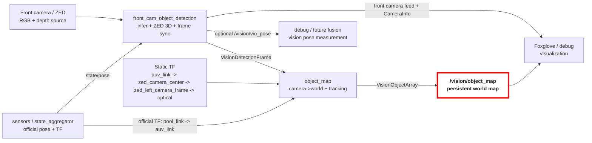

# Vision Package

This package contains the front-camera detection pipeline, the persistent 3D object map, optional image enhancement nodes, and the model-training/export helpers.

Key files:
- [vision_pipeline.launch.py](launch/vision_pipeline.launch.py)
- [front_cam_object_detection_node.py](vision/object_detection/front_cam_object_detection_node.py)
- [object_map.cpp](vision/object_map.cpp)
- [object_tracker.cpp](vision/object_map/object_tracker.cpp)

## Usage

Launch the full pipeline:

```bash
ros2 launch vision vision_pipeline.launch.py
```

Configuration is loaded from [config/vision_pipeline.yaml](config/vision_pipeline.yaml).

### Launch Parameters

| Parameter | Type | Default | Description |
|-----------|------|---------|-------------|
| `sim` | `bool` | `false` | Use simulation mode (sim topics, sim camera settings) |
| `compressed` | `bool` | `true` | Append `/compressed` to image topic names |
| `enhance_images` | `bool` | `false` | Enable image enhancement nodes; detection nodes subscribe to enhanced topics when true |
| `front_model_relative_path` | `string` | `models/local_rfdetr_onnx_test` | Path to front camera model package relative to vision package |
| `down_model_relative_path` | `string` | `models/template_yolo` | Path to down camera model package relative to vision package |
| `enable_object_detection` | `bool` | `true` | Enable object detection inference globally |
| `has_zed_sdk` | `bool` | `true` | Whether the ZED SDK is available (set `false` for non-ZED hardware) |

Example overrides:

```bash
ros2 launch vision vision_pipeline.launch.py sim:=true
ros2 launch vision vision_pipeline.launch.py compressed:=false
ros2 launch vision vision_pipeline.launch.py front_model_relative_path:=models/local_rfdetr_onnx_test
```

## Architecture



Node summary:
- `Front camera / ZED`: Provides the raw RGB images and ZED depth data used to build 3D detections.
- `sensors / state_aggregator`: Publishes the official aggregated AUV pose and the official `pool_link -> auv_link` TF.
- `front_cam_object_detection`: Runs the detector, asks ZED for 3D object positions, and packages each frame with one synchronized AUV pose.
- `Static TF`: Describes the fixed mounting relationship between the AUV body frame and the front camera frames.
- `object_map`: Converts camera-frame detections into world-frame objects and tracks them over time.
- `/vision/object_map`: **Main output**, exposes the persistent world-frame map as `VisionObjectArray`.
- `Foxglove / debug`: Visualizes the front camera feed, camera calibration, and mapped detections.
- `debug / future fusion`: Carries the optional vision-only VIO pose output for debugging or later estimator fusion.

## Nodes

### Front Camera Detection Node

The front camera node is responsible for:
- running model inference
- ingesting 2D boxes into the ZED SDK
- recovering 3D detections in the camera frame
- snapshotting one AUV pose per grabbed frame
- publishing one synchronized detection-frame message
- optionally publishing a front-camera debug feed, `CameraInfo`, depth images, and a VIO measurement/debug TF

The synchronized message types live in `auv_msgs`:
- [VisionDetection.msg](../auv_msgs/msg/VisionDetection.msg)
- [VisionDetectionFrame.msg](../auv_msgs/msg/VisionDetectionFrame.msg)

`VisionDetectionFrame` is the input to `object_map`. It carries:
- `header.stamp`: frame timestamp
- `header.frame_id`: 3D detection frame, currently `zed_left_camera_frame`
- `auv_pose`: AUV pose snapshot for that frame, typically from `state/pose`
- `detections`: camera-frame 3D detections plus the original model 2D bbox

#### How It Works

At a high level, the front camera node does this each frame:
1. `grab()` one ZED frame
2. snapshot one AUV pose for that same frame
3. run detector inference on the RGB image
4. optionally filter detections near image borders
5. optionally crop the lower half of gate boxes before depth ingestion
6. ingest the 2D boxes into the ZED SDK
7. retrieve 3D detections in `zed_left_camera_frame`
8. publish one `VisionDetectionFrame`

This keeps the expensive 2D-to-3D step close to the ZED SDK while still leaving world-frame conversion to `object_map`.

### Object Map Node

The object map node:
- subscribes to `VisionDetectionFrame`
- resolves the TF chain from `auv_link` to `zed_left_camera_frame`
- transforms detections from camera frame to world frame in C++
- tracks objects over time with a Kalman + Hungarian pipeline
- publishes the persistent map as:
  - [VisionObject.msg](../auv_msgs/msg/VisionObject.msg)
  - [VisionObjectArray.msg](../auv_msgs/msg/VisionObjectArray.msg)

#### How It Works

At a high level, `object_map` does this for each `VisionDetectionFrame`:
1. read the synchronized AUV pose from the message
2. resolve `auv_link -> zed_left_camera_frame` from TF
3. transform all camera-frame detections into `pool_link`
4. filter and track them with `ObjectTracker`
5. apply game-specific constraints and refinements
6. publish the persistent world-frame map as `VisionObjectArray`

### Sensors / Pose Ownership
The official vehicle pose and TF should come from the `sensors` package:
- `state/pose`
- `pool_link -> auv_link`

Vision can still publish a VIO measurement for debugging or future fusion:
- `/vision/vio_pose`
- optionally `pool_link -> auv_vio_link`

This is intentionally separate from the official `auv_link` TF so Foxglove and downstream nodes do not confuse vision VIO with the fused vehicle pose.

## Topics

### Subscriptions (Inputs)

| Topic | Type | Description |
|-------|------|-------------|
| `state/pose` | `geometry_msgs/PoseStamped` | Official AUV pose from sensors |
| `/vision/front_cam/image_enhanced` | `sensor_msgs/Image` | Optional enhanced image input (when `sim=true` and `enhance_images=true`) |

### Publications (Outputs)

| Topic | Type | Description |
|-------|------|-------------|
| `/vision/object_map` | `VisionObjectArray` | **Main output**, persistent world-frame object map |
| `/vision/front_cam/detection_frame` | `VisionDetectionFrame` | Synchronized detection frame |
| `/vision/front_cam/detection_frame/annotated` | `sensor_msgs/Image` | Front camera feed (annotated or raw, toggled via service) |
| `/vision/front_cam/detection_frame/camera_info` | `sensor_msgs/CameraInfo` | ZED left-camera calibration |
| `/vision/front_cam/detection_frame/depth` | `sensor_msgs/Image` | Optional depth image output |
| `/vision/vio_pose` | `geometry_msgs/PoseStamped` | Optional VIO-based AUV pose from vision |
| `/vision/down_cam/detections` | `vision_msgs/Detection2DArray` | Down camera 2D detections |

## Runtime Services

### Front Camera

- `/vision/front_cam/toggle_annotated_image` - `std_srvs/Trigger`
  - Toggles the front-camera feed between annotated and raw frames.

  ```bash
  ros2 service call /vision/front_cam/toggle_annotated_image std_srvs/srv/Trigger
  ```

- `/vision/front_cam/toggle_collection` - `auv_msgs/AutomaticCapture`
  - Enables/disables timed image collection and sets the interval.

  ```bash
  ros2 service call /vision/front_cam/toggle_collection auv_msgs/srv/AutomaticCapture '{"data": true, "time_interval": 1.0}'
  ```

- `/image_collection/toggle_manual_front_collection` - compatibility alias for the same `AutomaticCapture` behavior.

### Down Camera

- `/vision/down_cam/toggle_collection` - `auv_msgs/AutomaticCapture`

  ```bash
  ros2 service call /vision/down_cam/toggle_collection auv_msgs/srv/AutomaticCapture '{"data": true, "time_interval": 1.0}'
  ```

- `/vision/down_cam/toggle_annotated_image` - `std_srvs/Trigger`

  ```bash
  ros2 service call /vision/down_cam/toggle_annotated_image std_srvs/srv/Trigger
  ```

## What The Main Launch Actually Starts

The main launch currently focuses on the front-camera path:
- optional front image enhancement
- front camera object detection
- static TF publishers for the front camera
- object map

The down-camera nodes still exist, but they are not part of the default runtime pipeline in `vision_pipeline.launch.py`.

## Front Camera Debug Feed

The front debug feed intentionally uses one topic:
- `/vision/front_cam/detection_frame/annotated`

Behavior:
- if annotation is enabled, detections are drawn on the image
- if annotation is disabled, the same topic publishes the raw image

This keeps Foxglove simple because you do not need to switch image topics to compare raw vs annotated output.

## Frames And TF

The front-camera pipeline currently uses:
- `pool_link`: world / inertial frame
- `auv_link`: official AUV frame
- `auv_vio_link`: optional debug VIO frame from vision
- `zed_camera_center`: static camera mount frame
- `zed_left_camera_frame`: 3D detection frame used by the ZED SDK and `VisionDetectionFrame`
- `zed_left_camera_frame_optical`: optical frame used for image visualization and `CameraInfo`

The launch file publishes the static chain:
- `auv_link -> zed_camera_center`
- `zed_camera_center -> zed_left_camera_frame`
- `zed_left_camera_frame -> zed_left_camera_frame_optical`

This split matters:
- 3D detections stay in `zed_left_camera_frame`
- image-like topics use `zed_left_camera_frame_optical`

That layout is what Foxglove expects for correct camera visualization.

## 2026 Tracking / Mapping Logic

The tracker has several 2026-specific constraints:
- gate refinement from `search_rescue` and `survey_repair`
- board refinement from `ambulance`, `firetruck`, `fire`, and `blood`
- observer-facing yaw chosen using the current AUV position
- large-structure spawn filtering near pipes and other large structures
- configurable table/octagon refinement mode
- floor/surface Z locking for selected classes

The main tuning and counts are configured in:
- [config/vision_pipeline.yaml](config/vision_pipeline.yaml)

## Front Camera Pose Modes

`front_cam_object_detection` still supports two pose modes:
- `pose_source: auv_pose`
- `pose_source: zed_vio`

Current recommended setup:
- `enable_vio: false`
- `pose_source: auv_pose`
- use `state/pose` from `sensors`

If VIO is enabled:
- the node can publish `/vision/vio_pose`
- it can optionally publish `pool_link -> auv_vio_link`

If `enable_vio` is false, the node skips ZED positional tracking entirely.

## Configuration Notes

Some especially important front-camera parameters are:
- `model_detection_threshold`
- `depth_confidence_threshold`
- `zed_depth_maximum_distance`
- `zed_depth_minimum_distance`
- `zed_positional_tracking_depth_min_range`
- `zed_depth_stabilization`
- `zed_camera_resolution_sim`
- `zed_camera_resolution_real`
- `zed_camera_fps_sim`
- `zed_camera_fps_real`
- `zed_camera_flip_mode`
- `zed_self_calib`
- `zed_enable_right_side_measure`
- `zed_sdk_verbose`
- `zed_sdk_gpu_id`
- `zed_enable_image_enhancement`
- `zed_open_timeout_sec`
- `zed_async_grab_camera_recovery`
- `zed_grab_compute_capping_fps`
- `zed_enable_image_validity_check`
- `zed_optional_opencv_calibration_file`
- `zed_brightness`
- `zed_contrast`
- `zed_hue`
- `zed_saturation`
- `zed_sharpness`
- `zed_gamma`
- `zed_gain`
- `zed_exposure`
- `zed_auto_exposure_gain`
- `zed_auto_whitebalance`
- `zed_whitebalance_temperature`
- `zed_led_status`
- `enable_gate_top_crop`
- `gate_top_crop_ratio`
- `enable_border_exclusion`
- `border_exclusion_margin_px`
- `border_exclusion_labels`
- `publish_camera_info`
- `publish_annotated_image`
- `publish_depth_image`
- `collection_interval_seconds`
- `enable_vio`
- `pose_source`

`enable_border_exclusion` is a simple filter applied before ZED ingestion. For configured labels such as `gate`, any 2D detection touching the image border within `border_exclusion_margin_px` is dropped. This helps reject partial detections at the left/right image edges that often produce unstable depth or incorrect clipped 3D positions.

The ZED camera-control parameters are split into two groups:
- init-time controls such as resolution, FPS, and flip mode
- runtime ISP controls such as brightness, exposure, gain, gamma, white balance, and LED status

The current defaults intentionally start close to the ZED ROS 2 wrapper defaults for a ZED 2i:
- real camera: `VGA` at `15 FPS` (changed from HD1080 @ 15FPS)
- common stereo video tuning: saturation `4`, sharpness `4`, gamma `8`
- auto exposure/gain and auto white balance enabled by default

For the current front-camera pipeline, these controls are intentionally limited to settings that keep the left rectified camera model intact. The node still assumes:
- detections come from the left camera
- `VisionDetectionFrame` uses `zed_left_camera_frame`
- `CameraInfo` describes the left rectified camera

Some especially important object-map parameters are:
- `new_object_min_distance_threshold`
- `large_structure_labels`
- `pipe_labels`
- `min_large_structure_separation_m`
- `min_large_structure_pipe_separation_m`
- `enable_gate_midpoint_refinement`
- `enable_board_icon_refinement`
- `refinement_plausibility_radius`
- `table_octagon_refinement_mode`
- `enable_pipe_distance_truncation`
- `max_pipe_distance`
- `unique_objects`
- `floor_objects`
- `surface_objects`
- `max_per_class`

The `table_octagon_refinement_mode` parameter controls how table and octagon objects are published:
- `none`: no refinement, both are published independently
- `table_primary`: publish the octagon at the table XY
- `octagon_primary`: publish the table at the octagon XY
- `midpoint`: publish both at the shared midpoint XY; if only one is seen, use that XY for both

These modes only change the published `VisionObjectArray`. They do not modify the underlying `ObjectTracker` state for table or octagon.

## Package Scope

This repository package is currently a mixed runtime + model-development package:
- runtime ROS nodes live under `vision/`
- launch/config live under `launch/` and `config/`
- training/export helpers live under `model_pipeline/` and `models/`

That is convenient for development, but it also means the package is heavier than a pure runtime deployment package.

## Model Packages

Detection nodes load models using the [Roboflow `inference-models`](https://github.com/roboflow/inference/tree/main/inference_models) library. Each model lives in a self-contained directory under `models/` that `AutoModel.from_pretrained()` reads at startup.

A model package directory must contain:

| File | Purpose |
|------|---------|
| `model_config.json` | Architecture (`yolov11`, `rfdetr`), task type, backend (`onnx` or `trt`) |
| `inference_config.json` | Input preprocessing: resolution, color mode, resize strategy, pixel scaling, and normalization. Also post-processing settings like NMS thresholds for YOLO |
| `class_names.txt` | One class label per line, order matches the model output indices |
| `weights.onnx` | ONNX weights file (`.placeholder` in templates, replaced with real weights after export) |

The two templates under `models/` show the required layout:

- **`template_yolo/`** — YOLOv11 config. Preprocessing is just pixel scaling (`/255`), no mean/std normalization.
- **`template_rfdetr/`** — RF-DETR config. Pixel scaling (`/255`) followed by ImageNet mean/std normalization (`[0.485, 0.456, 0.406]` / `[0.229, 0.224, 0.225]`), which is standard for DINOv2-backbone models.

The `inference-models` library handles all preprocessing and postprocessing automatically based on these configs. The detection nodes just call `model(image)`.

> **Do not delete the template folders.** They are the reference for how to package a new model for deployment. To deploy a new model, copy the matching template, replace `weights.onnx.placeholder` with the real weights, and update `class_names.txt` if needed.

## Training And Model Export

The training/export helpers are under:
- [model_pipeline/README.md](model_pipeline/README.md)
- [models/export_rfdetr.py](models/export_rfdetr.py)

These tools are not part of the runtime launch path but they produce the deployed model packages under `models/`.
