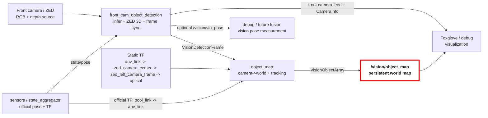

# Vision Package

This package contains the front-camera detection pipeline, the persistent 3D object map, optional image enhancement nodes, and the model-training/export helpers.

Key files:
- [vision_pipeline.launch.py](launch/vision_pipeline.launch.py)
- [front_cam_object_detection_node.py](vision/object_detection/front_cam_object_detection_node.py)
- [object_map.cpp](vision/object_map.cpp)
- [object_tracker.cpp](vision/object_map/object_tracker.cpp)

## Usage

Launch the full pipeline:

```bash
ros2 launch vision vision_pipeline.launch.py
```

Configuration is loaded from [config/vision_pipeline.yaml](config/vision_pipeline.yaml).

### Launch Parameters

| Parameter | Type | Default | Description |
|-----------|------|---------|-------------|
| `sim` | `bool` | `false` | Use simulation mode (sim topics, sim camera settings) |
| `compressed` | `bool` | `true` | Append `/compressed` to image topic names |
| `enhance_images` | `bool` | `false` | Enable image enhancement nodes; detection nodes subscribe to enhanced topics when true |
| `front_model_relative_path` | `string` | `models/local_rfdetr_onnx_test` | Path to front camera model package relative to vision package |
| `down_model_relative_path` | `string` | `models/template_yolo` | Path to down camera model package relative to vision package |
| `enable_object_detection` | `bool` | `true` | Enable object detection inference globally |
| `has_zed_sdk` | `bool` | `true` | Whether the ZED SDK is available (set `false` for non-ZED hardware) |

Example overrides:

```bash
ros2 launch vision vision_pipeline.launch.py sim:=true
ros2 launch vision vision_pipeline.launch.py compressed:=false
ros2 launch vision vision_pipeline.launch.py front_model_relative_path:=models/local_rfdetr_onnx_test
```

## Architecture



Node summary:
- `Front camera / ZED`: Provides the raw RGB images and ZED depth data used to build 3D detections.
- `sensors / state_aggregator`: Publishes the official aggregated AUV pose and the official `pool_link -> auv_link` TF.
- `front_cam_object_detection`: Runs the detector, asks ZED for 3D object positions, and packages each frame with one synchronized AUV pose.
- `Static TF`: Describes the fixed mounting relationship between the AUV body frame and the front camera frames.
- `object_map`: Converts camera-frame detections into world-frame objects and tracks them over time.
- `/vision/object_map`: **Main output**, exposes the persistent world-frame map as `VisionObjectArray`.
- `Foxglove / debug`: Visualizes the front camera feed, camera calibration, and mapped detections.
- `debug / future fusion`: Carries the optional vision-only VIO pose output for debugging or later estimator fusion.

## Nodes
### Small note on parameter nomenclature
Parameters in [`vision_pipeline.yaml`](config/vision_pipeline.yaml) are named with a hierarchical convention, where the node name is the highest level for the given node, e.g.
```yaml
front_cam_object_detection:
  ros__parameters:
    zed:
      resolution:
          sim: SVGA
```
refers to the zed camera resolution in simulation. This allows all parameters to be loading directly into the node by ROS convention. The parameters for each node are further grouped by functionality, e.g. all ZED-related parameters are under the `zed` namespace. From here, each level in the hierarchy will be delimited by periods, e.g. the parameter above would be the `zed.resolution.sim` parameter in the `front_cam_object_detection` node.
### Front Camera Detection Node

The front camera node is responsible for:
- Taking in front camera input
- running model inference to get 2D detections
- recovering 3D detections in the camera frame
- snapshotting one AUV pose per grabbed frame, which can either:
  - come directly from `state/pose` if `pose_source: auv_pose`
  - come from ZED positional tracking if `pose_source: zed_vio` and `enable_vio: true`
- publishing one synchronized detection-frame message, which includes the 3D detections and the corresponding AUV pose snapshot
- optionally publishing a front-camera debug feed, `CameraInfo`, depth images, and a VIO measurement/debug TF

The synchronized message types is defined in `auv_msgs`:
- [VisionDetection.msg](../auv_msgs/msg/VisionDetection.msg)
- [VisionDetectionFrame.msg](../auv_msgs/msg/VisionDetectionFrame.msg)

`VisionDetectionFrame` is the input to `object_map`. It carries:
- `header.stamp`: frame timestamp
- `header.frame_id`: 3D detection frame, set in the parameter `frame_id.detection` as `zed_left_camera_frame`
- `auv_pose`: AUV pose snapshot for that frame
- `detections`: wrapper containing 3D detections: 
  - camera-frame 3D detections plus the original model 2D bbox
  - `label`: object class label
  - `confidence`: detection confidence score from the model
  - `bbox_2d`: original 2D bounding box from the model inference
  - `pose_camera`: pose of the detected object in the camera frame


#### Front detection workflow

At a high level, the front camera node does this each frame:
1. `grab()` one ZED frame using the ZED SDK API
2. snapshot one AUV pose for that same frame
3. run detector inference on the RGB image
   1. optionally filter detections near image borders
   2. optionally crop the lower half of gate boxes before depth ingestion
4. ingest the 2D boxes into the ZED SDK to retrieve 3D detections in `zed_left_camera_frame`
5. publish one `VisionDetectionFrame`

Thus, detections are kept in the camera frame world-frame conversion to `object_map`.

### Down Camera Detection Node

The down camera node is currently a simpler 2D detection node without depth or pose synchronization. It:
- subscribes to the down camera RGB feed
- runs model inference to get 2D detections
- Publishes a `vision_msgs/Detection2DArray`

### Object Map Node

The object map node:
- subscribes to the output of the detection nodes
- resolves the TF chain from `auv_link` to `zed_left_camera_frame`
- transforms detections from camera frame to world frame
- tracks objects over time
- publishes the persistent map as:
  - [VisionObject.msg](../auv_msgs/msg/VisionObject.msg)
  - [VisionObjectArray.msg](../auv_msgs/msg/VisionObjectArray.msg)

#### How It Works

At a high level, `object_map` does this for each `VisionDetectionFrame`:
1. read the synchronized AUV pose from the message
2. resolves the transform from `auv_link` to `zed_left_camera_frame` at the frame timestamp
3. transform all camera-frame detections into `pool_link`
4. filter and track them with `ObjectTracker`, which
   1. performs data association to match detections to existing tracks using the Hungarian algorithm and a gating threshold on Mahalanobis distance
   2. Updates matched tracks with the new detections using a Kalman filter update step
   3. Initializes new tracks for unmatched detections that are sufficiently far from existing tracks
      - tracks are marked as TENTATIVE when first initialized, which can be deleted if they fail to initialize within some number of frames
      - TENTATIVE tracks can be promoted to CONFIRMED after a configurable number of consecutive matches
      - CONFIRMED tracks that lose detection matches degrade back to TENTATIVE
5. apply game-specific constraints and refinements
6. publish the persistent world-frame map as `VisionObjectArray`

Down cam processing TBD, but it will likely subscribe to the down cam 2D detections and incorporate it into the object map.

### Sensors / Pose Ownership
The official vehicle pose and TF should come from the `sensors` package:
- `state/pose`
- `pool_link -> auv_link`

Vision can still publish a VIO measurement for debugging or future fusion:
- `/vision/vio_pose`
- optionally `pool_link -> auv_vio_link`

This is intentionally separate from the official `auv_link` TF so Foxglove and downstream nodes do not confuse vision VIO with the fused vehicle pose.

## Topics

### Subscriptions (Inputs)

| Topic | Type | Description |
|-------|------|-------------|
| `state/pose` | `geometry_msgs/PoseStamped` | Official AUV pose from sensors |
| `/vision/front_cam/image_enhanced` | `sensor_msgs/Image` | Optional enhanced image input (when `sim=true` and `enhance_images=true`) |

### Publications (Outputs)

| Topic | Type | Description |
|-------|------|-------------|
| `/vision/object_map` | `VisionObjectArray` | **Main output**, persistent world-frame object map |
| `/vision/front_cam/detection_frame` | `VisionDetectionFrame` | Synchronized detection frame |
| `/vision/front_cam/detection_frame/annotated` | `sensor_msgs/Image` | Front camera feed (annotated or raw, toggled via service) |
| `/vision/front_cam/detection_frame/camera_info` | `sensor_msgs/CameraInfo` | ZED left-camera calibration |
| `/vision/front_cam/detection_frame/depth` | `sensor_msgs/Image` | Optional depth image output |
| `/vision/vio_pose` | `geometry_msgs/PoseStamped` | Optional VIO-based AUV pose from vision |
| `/vision/down_cam/detections` | `vision_msgs/Detection2DArray` | Down camera 2D detections |

## Runtime Services

### Front Camera

- `/vision/front_cam/toggle_annotated_image` - `std_srvs/Trigger`
  - Toggles the front-camera feed between annotated and raw frames.

  ```bash
  ros2 service call /vision/front_cam/toggle_annotated_image std_srvs/srv/Trigger
  ```

- `/vision/front_cam/toggle_collection` - `auv_msgs/AutomaticCapture`
  - Enables/disables timed image collection and sets the interval.

  ```bash
  ros2 service call /vision/front_cam/toggle_collection auv_msgs/srv/AutomaticCapture '{"data": true, "time_interval": 1.0}'
  ```

- `/image_collection/toggle_manual_front_collection` - compatibility alias for the same `AutomaticCapture` behavior.

### Down Camera

- `/vision/down_cam/toggle_collection` - `auv_msgs/AutomaticCapture`

  ```bash
  ros2 service call /vision/down_cam/toggle_collection auv_msgs/srv/AutomaticCapture '{"data": true, "time_interval": 1.0}'
  ```

- `/vision/down_cam/toggle_annotated_image` - `std_srvs/Trigger`

  ```bash
  ros2 service call /vision/down_cam/toggle_annotated_image std_srvs/srv/Trigger
  ```

## Front Camera Debug Feed

The front debug feed intentionally uses one topic:
- `/vision/front_cam/detection_frame/annotated`

Behavior:
- if annotation is enabled, detections are drawn on the image
- if annotation is disabled, the same topic publishes the raw image

This keeps Foxglove simple because you do not need to switch image topics to compare raw vs annotated output.

## Frames And TF

The front-camera pipeline currently uses:
- `pool_link`: world / inertial frame
- `auv_link`: official AUV frame
- `auv_vio_link`: optional debug VIO frame from vision
- `zed_camera_center`: static camera mount frame
- `zed_left_camera_frame`: 3D detection frame used by the ZED SDK and `VisionDetectionFrame`
- `zed_left_camera_frame_optical`: optical frame used for image visualization and `CameraInfo`

The launch file publishes the static chain:
- `auv_link -> zed_camera_center`
- `zed_camera_center -> zed_left_camera_frame`
- `zed_left_camera_frame -> zed_left_camera_frame_optical`

This split matters:
- 3D detections stay in `zed_left_camera_frame`
- image-like topics use `zed_left_camera_frame_optical`

That layout is what Foxglove expects for correct camera visualization.

## 2026 Tracking / Mapping Logic

### Front-Camera Filters

- `enable_border_exclusion` is a simple filter applied before ZED ingestion. For configured labels such as `gate`, any 2D detection touching the image border within `border_exclusion_margin_px` is dropped. This helps reject partial detections at the left/right image edges that often produce unstable depth or incorrect clipped 3D positions.


### Object Map Filters

### Tracker

The tracker has several 2026-specific constraints:
- gate refinement from `search_rescue` and `survey_repair`
- board refinement from `ambulance`, `firetruck`, `fire`, and `blood`
- observer-facing yaw chosen using the current AUV position
- large-structure spawn filtering near pipes and other large structures
- configurable table/octagon refinement mode
- floor/surface Z locking for selected classes

The main tuning and counts are configured in:
- [config/vision_pipeline.yaml](config/vision_pipeline.yaml)

## Front Camera Pose Modes


## Configuration

### Front Camera Parameters

#### Model

Parameters related to the detection model and preprocessing, all prefixed with `model`.

| Parameter             | Description                                                                          |
| --------------------- | ------------------------------------------------------------------------------------ |
| `relative_path`       | Relative path to the front camera model configuration (relative to the package root) |
|                       |
| `class_names`         | List of class names corresponding to the model output indices                        |
| `detection_threshold` | Confidence threshold for filtering model detections                                  |

#### Quality of Service
Parameters related to ROS QoS settings for subscriptions and publications, all prefix with `qos`.
| Parameter    | Description                                              |
| ------------ | -------------------------------------------------------- |
| `queue_size` | Size of the message queue for publishers and subscribers |

#### ZED

Parameters specific to the ZED camera, see [vision_pipeline.yaml](config/vision_pipeline.yaml) for the full list, all prefixed with `zed`. Some especially important ones:

- `resolution.sim` and `resolution.real`: ZED SDK resolution settings for simulation and real hardware. The current defaults are 
  - `SVGA` at `30 FPS` for the sim (to match the Unity ZED X Sim stream resolution) 
  - `VGA` at `30 FPS` for real.
- `optional_opencv_calibration_file`: path to an optional OpenCV calibration file that can be loaded instead of the factory calibration. Underwater environments may require custom calibration to be performed, and this parameter allows loading that calibration without modifying the code.
- `depth.mode` algorithm to use for ZED depth retrieval, defaults to `NEURAL` for neural network based depth estimation

#### Image 

Image processing parameters, all prefixed with `image`.

#### Pose

Parameters related to pose sources, all prefixed with `pose_source`.

`front_cam_object_detection` still supports two pose modes:
- `pose.pose_source: auv_pose`
- `pose.pose_source: zed_vio`

Current recommended setup:
- `pose.vio.enable: false`
- `pose.pose_source: auv_pose`
- use `state/pose` from `sensors`

If VIO is enabled:
- the node can publish `/vision/vio_pose`
- it can optionally publish `pool_link -> auv_vio_link`

If `pose.vio.enable` is false, the node skips ZED positional tracking entirely.

#### Frame IDs

Parameters related to header frame IDs, used in TF lookup and message headers, all prefixed with `frame_id`.

#### Extrinsics

Parameters related to the static extrinsic TF chain from `auv_link` to the camera frames, all prefixed with `extrinsics`.

#### Debug publishing

Optional debug publishing parameters, all prefixed with `debug_publish`.

#### Stream

In simulation mode, if ZED SDK is available, the front camera node can grab frames directly from the ZED Unity Sim stream. The `stream` parameters configure the IP and port for that stream, which defaults to `127.0.1.1:30000`.

The `table_octagon_refinement_mode` parameter controls how table and octagon objects are published:
- `none`: no refinement, both are published independently
- `table_primary`: publish the octagon at the table XY
- `octagon_primary`: publish the table at the octagon XY
- `midpoint`: publish both at the shared midpoint XY; if only one is seen, use that XY for both

These modes only change the published `VisionObjectArray`. They do not modify the underlying `ObjectTracker` state for table or octagon.
For the current front-camera pipeline, these controls are intentionally limited to settings that keep the left rectified camera model intact. The node still assumes:
- detections come from the left camera
- `VisionDetectionFrame` uses `zed_left_camera_frame`
- `CameraInfo` describes the left rectified camera

#### 
## Package Scope

This repository package is currently a mixed runtime + model-development package:
- runtime ROS nodes live under `vision/`
- launch/config live under `launch/` and `config/`
- training/export helpers live under `model_pipeline/` and `models/`

That is convenient for development, but it also means the package is heavier than a pure runtime deployment package.

## Model Packages

Detection nodes load models using the [Roboflow `inference-models`](https://github.com/roboflow/inference/tree/main/inference_models) library. Each model lives in a self-contained directory under `models/` that `AutoModel.from_pretrained()` reads at startup.

A model package directory must contain:

| File | Purpose |
|------|---------|
| `model_config.json` | Architecture (`yolov11`, `rfdetr`), task type, backend (`onnx` or `trt`) |
| `inference_config.json` | Input preprocessing: resolution, color mode, resize strategy, pixel scaling, and normalization. Also post-processing settings like NMS thresholds for YOLO |
| `class_names.txt` | One class label per line, order matches the model output indices |
| `weights.onnx` | ONNX weights file (`.placeholder` in templates, replaced with real weights after export) |

The two templates under `models/` show the required layout:

- **`template_yolo/`** — YOLOv11 config. Preprocessing is just pixel scaling (`/255`), no mean/std normalization.
- **`template_rfdetr/`** — RF-DETR config. Pixel scaling (`/255`) followed by ImageNet mean/std normalization (`[0.485, 0.456, 0.406]` / `[0.229, 0.224, 0.225]`), which is standard for DINOv2-backbone models.

The `inference-models` library handles all preprocessing and postprocessing automatically based on these configs. The detection nodes just call `model(image)`.

> **Do not delete the template folders.** They are the reference for how to package a new model for deployment. To deploy a new model, copy the matching template, replace `weights.onnx.placeholder` with the real weights, and update `class_names.txt` if needed.

## Training And Model Export

The training/export helpers are under:
- [model_pipeline/README.md](model_pipeline/README.md)
- [models/export_rfdetr.py](models/export_rfdetr.py)

These tools are not part of the runtime launch path but they produce the deployed model packages under `models/`.
